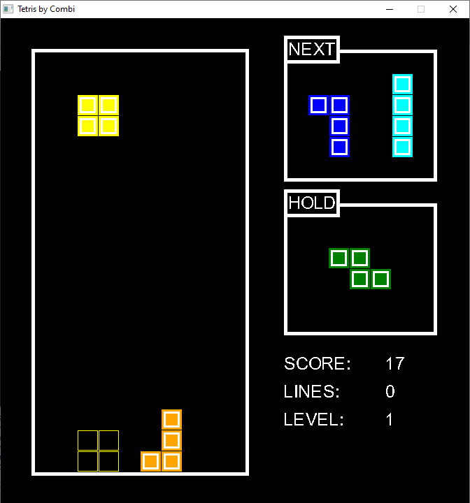

# Bai Tap Lon

## Game TETRIS do Combi code

1.  Feature:
  * Bảng 10 x 20.
  * Đầy đủ các khối với màu cố định cho từng khối.
  * Có bảng dự đoán các khối sẽ rơi ra tiếp theo.
  * Có bảng cho biết khối nào đang được lưu trữ để dùng sau này.
  * Có ô dự đoán vị trí rơi của khối cho việc tính toán dễ dàng hơn.

2. Tutorial
  * Mũi tên trái:   Di chuyển khối hiện tại 1 đơn vị về bên trái (nếu có thể)
  * Mũi tên phải:   Di chuyển khối hiện tại 1 đơn vị về bên phải (nếu có thể)
  * Mũi tên xuống:  Di chuyển khối hiện tại 1 đơn vị xuông dưới nhanh hơn (nếu có thể di chuyển được sẽ được cộng điểm)
  * Mũi tên lên:    Xoay khối hiện tại theo chiều kim đồng hồ (Nếu có thể)
  * Phím a:         Xoay khối hiện tại ngược chiều kim đồng hồ (Nếu có thể)
  * Phím s:         Xoay khối hiện tại theo  chiều kim đồng hồ (Nếu có thể)
  * Phím SPACE:     Thả khối hiện tại xuống vị trí được dự đoán và khối tiếp theo sẽ được đưa vào.
  * Phím c:         Giữ khối hiện tại vào kho lưu trữ (nếu khối này không phải được lấy ra từ kho lưu trữ) và khối trong kho lưu trữ sẽ được lấy ra hoặc khối được dự đoán nếu trong kho không có khối nào.
